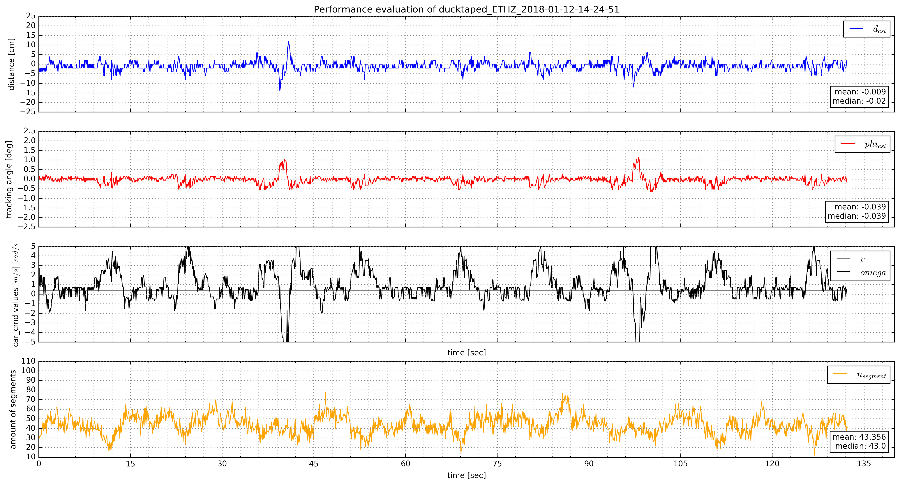
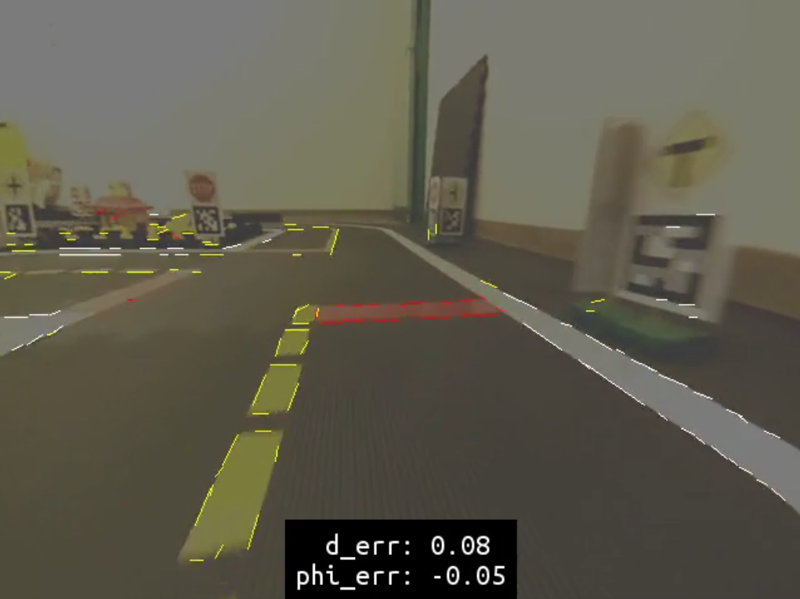

# Package `benchmark' {#benchmark}

This package contains the benchmark code used for the controllers project. It basically takes one or more rosbags in a specific folder and evaluates the run of the corresponding Duckiebot for d_ref and phi_ref and plots them into a diagram.

Additionally if the rosbag does not contain any pose information, it takes the pictures and calculates the transformation and line segments itself. It does also plot the values onto the pictures, so those pictures can be combined to a video.

## Output

Output diagram should look like this.

Output data should look like this.

Processed frames look like this.

## How to run

Basically you need to navigate to the folder that contains the benchmark code. In this case:

    $ /catkin_ws/src/10-lane-control/benchmark/

Then execute following code:

    $ python benchmark path/to/folder_containing_rosbags

You can specify the path to a single rosbag or you can specify the general folder containing several rosbags and it will process all those which haven't processed yet and safe the output into a folder "output" unless otherwise defined.
To get help on the flags type:

    $ python benchmark --help

There are following flags:

     --output 	Name of the output folder (Default: 'output')
     --save_images 	Extract and safe all frames from the rosbag (Default: False)
     --preparer	Define other preparer for image pipeline (Default: prep_120_40)
     --fast		Do not process image frames (Default: True)
