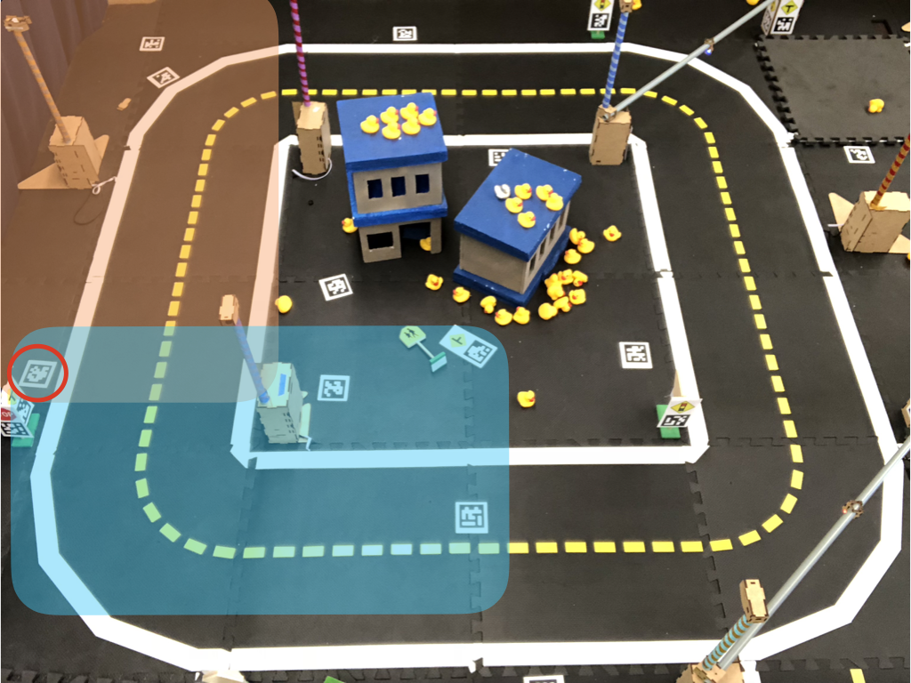
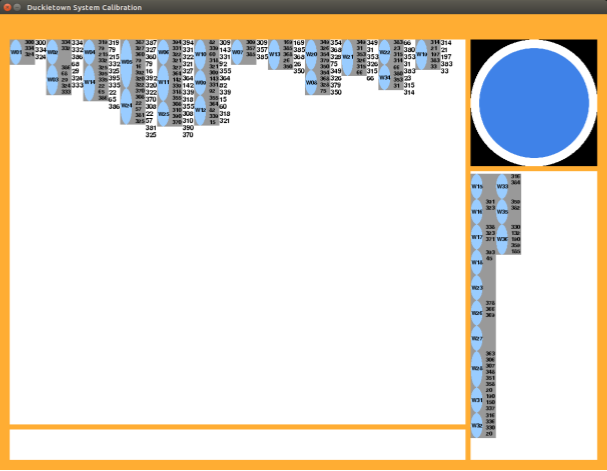
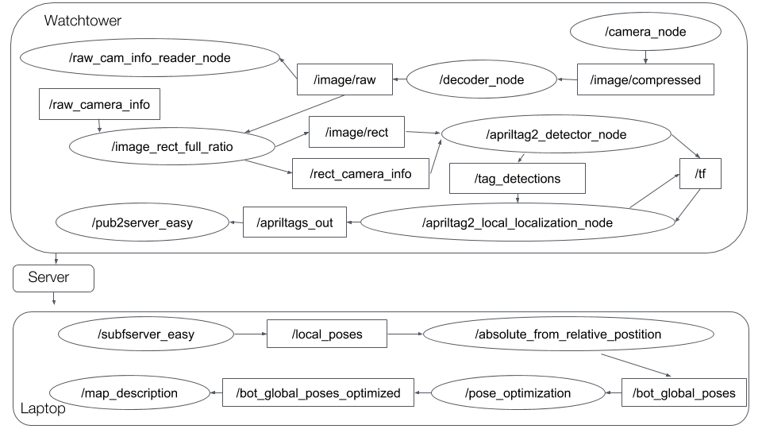
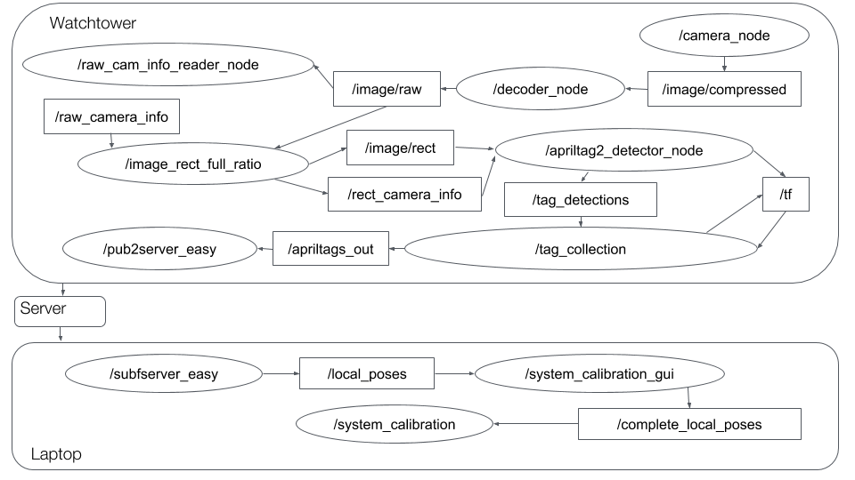

# Package `auto_localization` {#auto_localization}

The function of this package is to localize all the Duckiebots in a Duckietown in an autolab.

## How to use this package

Latest Branch: devel-auto-localization
Note: The package is still under development. The usage might change day-by-day.

### Map Setup

#### Reference tag setup

There should be at least one reference tag in the field of views of each watchtowers. The reference tags could be traffic sign tags or we could put tags there. The only thing to aware is that don't out a tag in the city twice.

#### Map file setup

You need to create your own map file to make the system work! Create a map file on your server computer.

    laptop $ cd ~/duckietown/catkin_ws/src/30-localization-and-planning/auto_localization/config
    laptop $ cp testcircle_origin(dontoverwrite).yaml ![your map].yaml

The `your map`.yaml is the map file for your robotarium, name it whatever you want.

Edit `your map`, what you have to do are
  1. Modify the id of `origin` to your origin tag id
  2. Add **ALL** your watchtowers' hostnames to `watchtowers`, in the system calibration the server computer will wait until all watchtower send tag informations.
  3. Build up your map. Edit `tiles` to the configuration of your map.

You don't need to modify anything under "fixed_tags", which store the transformation matrix of each reference tags to the origin tag. The system calibration step will do that for you!.

_The default map for localization system is None. You need to specify the map each time._

_The default map for system calibration is testcircle.yaml_

### Watchtowers setup

Make sure all watchtowers are connected with power cables and ethernet cables. Checkout the newest branch (at the moment: devel-auto-localization). Do catkin_make on all watchtowers.

    watchtower $ git checkout devel-auto-localization
    watchtower $ catkin_make -C catkin_ws

### System Calibration

To perform auto-localization, we need to know the transformation between local frame and the global frame . Of course one could enter the pose of each tag hand-by-hand, but that will be pretty annoying and inefficient. Here we introduce a tool that could calibrate the whole system, provide the transformation of each tag and save them to and yaml file for future usage.

#### Before Calibration

The system calibration require the reference tags to be linked to the origin tag. Thus, we might need to put some "linked" tag to make the graph complete. The linked tags are suggested to be put in the overlap region of watchtowers so that they really achieve their function.

<figure>
    

      
      <figcaption>The orange area is the rough field of view if the upper left watchtower. The blue are is the rough field of view of the lower left watchtower. The circled tag thus serve as a "linked tag which connect tags between these two watchtowers"</figcaption>
    

</figure>

The only constraint of putting the linked tag is that don't use the tags that have been used in the town. Always make sure you don't use the same tag twice.

#### Calibration

Execute these commands on your server computer (could be your laptop) to start central server for TCP/IP.

![IP_address] is the IP address of computer you wanna set it as server.

![your map] is the map file of your map.

    server $ make auto_localization_calibration_server IP:=![IP_address]

Open a terminal on your laptop, start calibration procedure on your laptop.

    laptop $ make auto_localization_calibration_laptop IP:=![IP_address] map=![your map]

Open ssh connections to all watchtowers through [xpanes](#xpanes) and [tmux](#tmux). Execute the command on watchtowers

    watchtowers $ make auto_localization_calibration_watchtower IP:=![IP_address]

<figure>
    

      
      <figcaption>This is the GUI of calibration. Each little square shows the number of watchtower and the tags that seen by the watchtower. Different column in the left panel imply the different level in the link. The numbers behind each level are the tags that seen by the level. The lower right panel shows watchtowers that have not been in the link. If the number of tag is shown in red, it means that the other way of transformatino has not been received yet. (i.e. The system gets the transformation from A to B but has no transformation from B to A).</figcaption>
    

</figure>

#### Result of System Calibration

  You can find a file called `map_name_date_and_time.yaml` in folder auto_localization/config. This is the map you should use while performing localization which included the transformation matrix of tags.

#### Some more explanation about System Calibration

The system calibration require the reference tags to be linked to the origin tag.

### System Localization

First on your server computer (could be your laptop), execute following commands.

![IP_address] should be the IP address of computer you wanna set it as server.

![your map] is the map file of your map.

    server $ make auto_localization_server IP:=![IP_address]

Open a terminal on your laptop, start localization procedures on your laptop

    laptop $ make auto_localization_laptop IP:=![IP_address] map=![your map]

Open ssh connections to all watchtowers through [xpanes](#xpanes) and [tmux](#tmux). Execute the command on watchtowers

    watchtower $ make auto_localization_watchtower IP:=![IP_address]

<figure>
    

      
      <figcaption>This is the GUI of auto-localization. The configuration of the map can be modify in map.yaml file. Here we use a test circle as an example. The general data area shows the general data of the system status. The robot data area shows the data of a specific Duckiebot. (One can click on the bot in the map to choose which bot data to show). The blue things in the map is a Duckiebot. The size of the circle implies the deviation of the position. The diretion of the arc implies the direction of the Duckiebot. The angle of the arc implies the deviation of the orientation.</figcaption>
    

</figure>

#### System Localization Output

##### Topic

The system starts working. On laptop, the `~bot_global_optimizae_poses` topic publishes Duckiebots' poses, reference tags it take reference to, and the camera that detect the Duckiebot.

##### Result file

The system also records all records under `auto_localization/config` folder with .csv file. You could checkout the performances of each Duckiebot in the file.

The result before and after optimization are all saved.

### Others

For watchtowers that are also trafficlights:
ssh to all trafficlights
    duckiebot $ git checkout devel-auto-localization-trafficlight
    duckiebot $ make auto_localization_watchtower_trafficlight

## System Architecture

### Concept of Auto-localization

The auto-localization relies on the local reference Apriltags. The system will first calculate the pose of an Duckiebot w.r.t the reference tag and later on do transfer the pose from the local frame to the global frame. Finally, since the system will generate several poses for one Duckiebot at one specific time stamp (w.r.t to different reference tags or watchtowers), the system will finally merge these poses by mean of each values.

<figure>
    
</figure>

###  Nodes

After apriltag detection nodes, these are the nods that contribute to the localization.

*On the Watchtowers*

| Node         | functions of the node                               |
|--------------|-----------------------------------------------------|
| apriltags2_local_localization_node | Transform the pose of Duckiebots from the camera frame to the frame of tags in the Duckietown   |
| pub2server_easy | Subscribe the results of local localization and set variables of those results in the server through TCPIP |

*On the Laptop*

| Node         | functions of the node                               |
|--------------|-----------------------------------------------------|
| subfserver_easy | Get the variables from the server, and publish them for the usage at the laptop. |
| absolute_from_relative_position | Transfer all local poses into global poses for each robots. |
| pose_optimization | Merge several poses generated for one Duckiebot w.r.t different reference tags or watchtowers. |
| map_description | GUI for showing the results of localization. |

### Topics

Here we listed out the topics for every future developers.

*On the Watchtowers*

| Topics       | Data type         |  Publisher         | Subscriber           | Description |
|--------------|-------------------|--------------------|----------------------| ----------- |
| ~apriltags_out | RemapPoseArray (See duckietown_msgs for more info)   |  apriltags2_local_localization_node | pub2server_easy  | Messages contain poses of Duckiebots w.r.t local tags in Duckietown |

*On the Laptop*

| Topics       | Data type         |  Publisher         | Subscriber           | Description |
|--------------|-------------------|--------------------|----------------------| ----------- |
| ~local_poses | RemapPoseArray (See duckietown_msgs for more info)   |  subfserver_easy | absolute_from_relative_position | Messages contain poses of Duckiebots w.r.t local tags in Duckietown. Should be transfer to World frame in the next step |
| ~bot_global_poses | GlobalPoseArray (See duckietown_msgs for more info)   |  absolute_from_relative_position | pose_optimization | Messages contain poses of Duckiebots w.r.t global frame in Duckietown. |
| ~bot_global_poses_optimized | GlobalPoseArray (See duckietown_msgs for more info)   |  pose_optimization | map_description | Messages contain _the_ pose of Duckiebots w.r.t global frame in Duckietown. |

### Concept of Calibration for Auto-localization

The purpose of system calibration is getting the transformation matrix from every reference tag to the origin tag. By these matrices, we could transform a Duckiebot pose from a local reference-tag frame to the global frame. To do so, we first get the transformation matrices between each tags (linked. Once there is one or two tags "linked" to the origin tag, we could obtain the matrices by these "links" to all other tags

<figure>
    
</figure>

###  Nodes

After apriltag detection nodes, these are the nods that contribute to the localization.

*On the Watchtowers*

| Node         | functions of the node                               |
|--------------|-----------------------------------------------------|
| tag_collection | Collect and publish transformation matrices between tags.   |
| pub2server_easy | Subscribe the results of tag_collection and set variables of those results in the server through TCPIP |

*On the Laptop*

| Node         | functions of the node                               |
|--------------|-----------------------------------------------------|
| subfserver_easy | Get the variables from the server, and publish them for the usage at the laptop. |
| system_calibration_gui | GUI for showing the status of calibration as well as make sure that every tag is linked to the origin tag. |
| system_calibration | Calculate the matrices between reference tags and the origin tag and save the result to a map.csv file. |

### Topics

Here we listed out the topics for every future developers.

*On the Watchtowers*

| Topics       | Data type         |  Publisher         | Subscriber           | Description |
|--------------|-------------------|--------------------|----------------------| ----------- |
| ~apriltags_out | RemapPoseArray (See duckietown_msgs for more info)   |  apriltags2_local_localization_node | pub2server_easy  | Messages contain poses (matrix) of one local tags w.r.t another local tags in Duckietown |

*On the Laptop*

| Topics       | Data type         |  Publisher         | Subscriber           | Description |
|--------------|-------------------|--------------------|----------------------| ----------- |
| ~local_poses | RemapPoseArray (See duckietown_msgs for more info)   |  subfserver_easy | system_calibration_gui | Messages contain poses (matrix) of one local tags w.r.t another local tags in Duckietown |
| ~complete_local_poses | GlobalPoseArray (See duckietown_msgs for more info)   |  system_calibration_gui | system_calibration | _All_ poses (matrix) of one local tags w.r.t another local tags in Duckietown |
