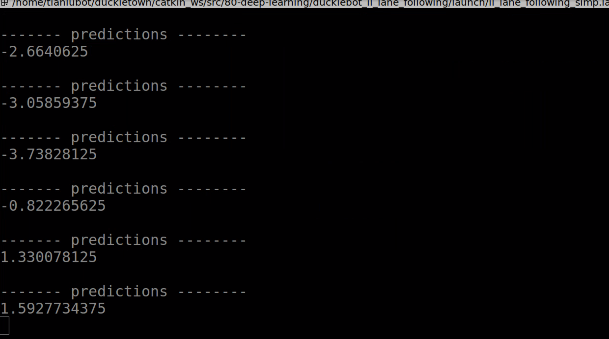

# Package `supervised_learning` {#supervised_learning}

This is the implementation of the package duckiebot_il_lane_following.

The following command can start the function of Duckiebot's lane following based on deep learning:

    $ roslaunch duckiebot_il_lane_following il_lane_following_simp.launch 

which results in an output in console as following, and the Duckiebot starts lane following. The prediction value is the orientation for Duckiebots, which is computed by Neural Compute Dtick and loaded CNN.

